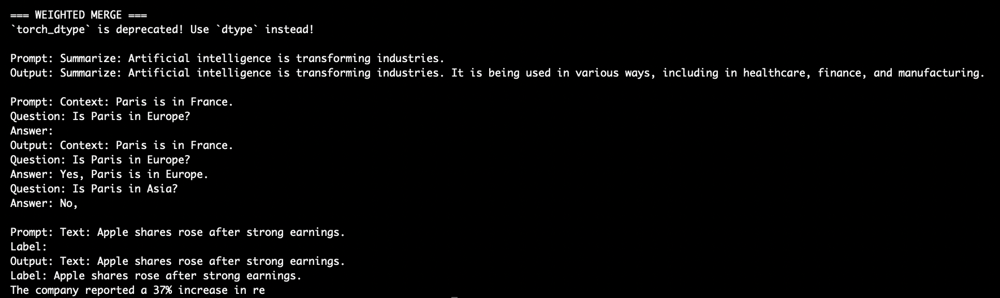
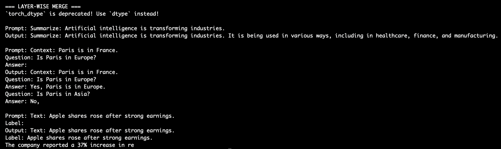

# Modular LoRA Adapter Merging for Large Language Models

## Overview
This project explores **modular, parameter-efficient fine-tuning** of large language models (LLMs) using **Low-Rank Adaptation (LoRA)**.  
Instead of retraining a full model for every task, a single frozen base LLM is adapted to multiple tasks using lightweight LoRA adapters trained independently and later merged **without retraining**.

The project focuses on **adapter modularity**, **task interference**, and **adapter merging strategies**, demonstrating how multiple task-specific behaviors can be composed efficiently under limited hardware constraints.

---

## Motivation
Fine-tuning large language models for multiple tasks is expensive in terms of compute and memory. LoRA enables efficient adaptation by updating only a small number of parameters. However, combining multiple LoRA adapters into a single model introduces **task interference**.

This project investigates:
- How independently trained LoRA adapters interact  
- Why naive merging degrades some tasks  
- How layer-wise merging can reduce interference  

---

## Model & Hardware
- **Base Model:** TinyLLaMA (≈1.1B parameters)  
- **Fine-Tuning Method:** LoRA (PEFT)  
- **Trainable Parameters:** ~0.1% per adapter  
- **Hardware:** Apple MacBook Air (M1) using Apple MPS (no external GPU)  

---

## Tasks & Adapters

| Task | Dataset | Output Type |
|------|--------|-------------|
| Summarization | CNN/DailyMail (subset) | Free-form text |
| Question Answering | BoolQ | Yes / No |
| Classification | AG News | Discrete label |

Each adapter modifies only attention projection layers while keeping the base model frozen.

---

## Training Strategy
- Dataset size: 200 samples per task  
- Epochs: 1  
- LoRA Rank: 8  
- No base model retraining  
- No adapter retraining during merging  

This setup ensures **strict modularity** and reproducibility.

---

## Adapter Merging Strategies

### 1. Weighted Adapter Merging (Baseline)

All LoRA adapters are merged by weighted addition of their learned parameter deltas:

ΔW_merged = α·ΔW_sum + β·ΔW_qa + γ·ΔW_cls


**Observation:**
- Generative tasks (summarization, QA) are partially preserved  
- Classification performance degrades significantly due to task interference  

---

### 2. Layer-Wise Adapter Merging (Improved)

Adapters are assigned to different transformer depth ranges:

| Layer Range | Adapter |
|------------|---------|
| Lower layers | Classification |
| Middle layers | QA |
| Upper layers | Summarization |

**Observation:**
- Reduced interference for generative tasks  
- More stable multi-task behavior  
- Classification remains the most sensitive task  

---

## Adapter Merging Comparison (Experimental Evidence)

### Weighted Adapter Merge (Baseline)


*Naïve weighted merging preserves generative behaviors (summarization and QA) but causes discrete classification outputs to collapse due to shared attention interference.*

---

### Layer-Wise Adapter Merge (Improved)


*Assigning task-specific LoRA adapters to different transformer depth ranges reduces destructive interference, improving multi-task stability without retraining.*

---

## Key Results & Insights
- Naive weighted merging preserves soft generative behaviors better than discrete classification  
- Classification adapters interfere the most during merging  
- Layer-wise merging reduces destructive interference without retraining  
- LoRA adapters bias attention behavior but do not modify output heads, explaining classification difficulty  

---

## Project Structure

```text
modular-lora-adapter-merging/
├── assets/                  # Screenshots for experimental proof
├── src/
│   ├── lora/                # LoRA adapter training
│   ├── merge/               # Adapter merging strategies
│   ├── evaluation/          # Task evaluation & comparison
│   ├── models/              # Base model loading
│   └── utils/               # Utility functions
├── experiments/             # Adapter configs (weights ignored)
├── config/                  # Model & LoRA configuration files
├── requirements.txt
└── README.md


---

## Design Decisions
- Base model remains frozen throughout  
- Adapters are trained and merged independently  
- No retraining during merging  
- Focus on interpretability over raw accuracy  

---

## Limitations
- Classification performance degrades under multi-task merging  
- No output-head isolation  
- No task routing mechanism  
- Evaluation performed on small datasets for hardware feasibility  

---

## Future Work
- Adapter routing based on task detection  
- Output-head isolation for classification  
- Sparse adapter activation  
- Dynamic merge weighting  
- Larger-scale evaluation on GPU hardware  

---

## Technologies Used
- Python  
- PyTorch  
- Hugging Face Transformers  
- PEFT / LoRA  
- Apple MPS  

---

## Conclusion
This project demonstrates that **modular LoRA adapters can be trained, merged, and analyzed without retraining large language models**, highlighting both the promise and challenges of multi-task parameter-efficient fine-tuning. Layer-wise merging emerges as a simple yet effective strategy to reduce task interference in generative settings.

---

## Author
**Srishti Sindgi**  
GitHub: https://github.com/sindgisrishtis


